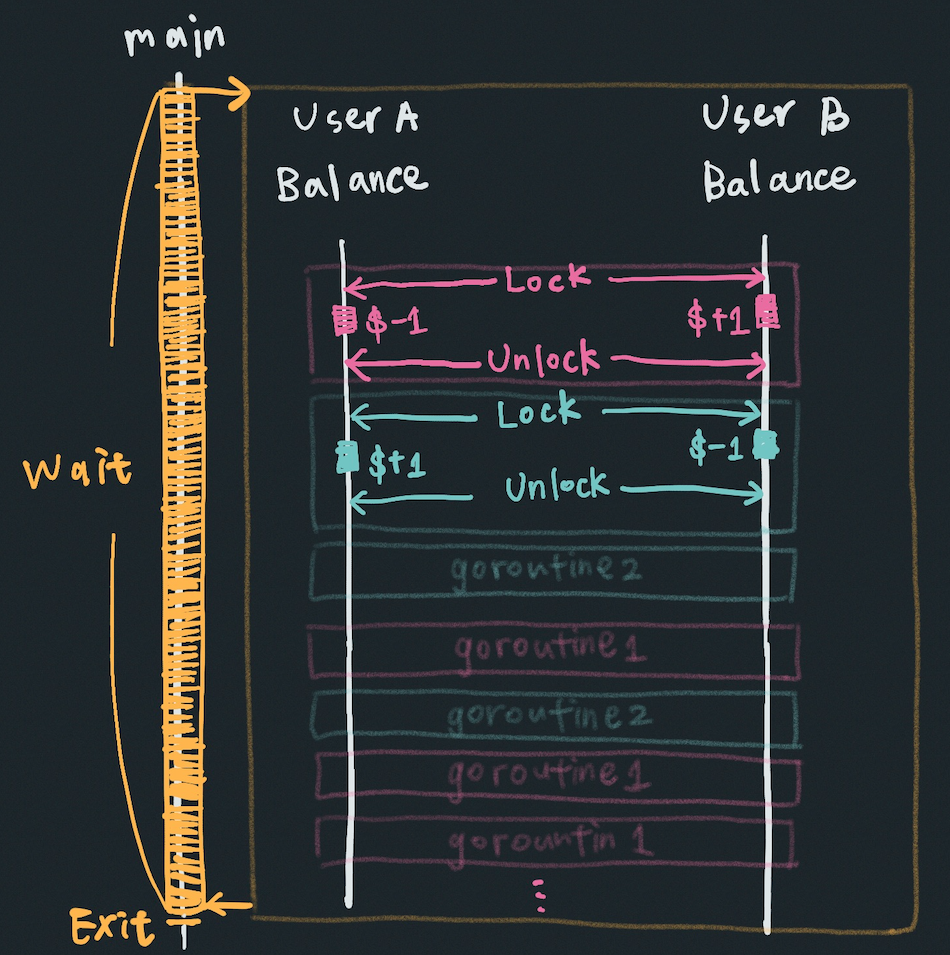

# Mutex

執行這段程式碼，會出現以下 "symbol too large" 錯誤，原因是試圖建立一個大小超過 2GB 的陣列：

```bash
$ go run main.go

./main.go:33:16: main..stmp_0: symbol too large (800000000000 bytes > 2000000000 bytes)
./main.go:33:16: main..stmp_1: symbol too large (800000000000 bytes > 2000000000 bytes)
```

要解決這個問題，將 `[10e10]uint64{}` 改使用 slice `make([]uint64, 10e10)`，
就可以執行這段程式。



這段程式分別建立了兩個 goroutine，並在進行 `transfer()` 之前，
要先取得轉出方和轉入方的 Lock，確保每次在進行 `transfer()` 時，只會有一個 goroutine 在操作餘額，
以達成帳務操作的原子性。